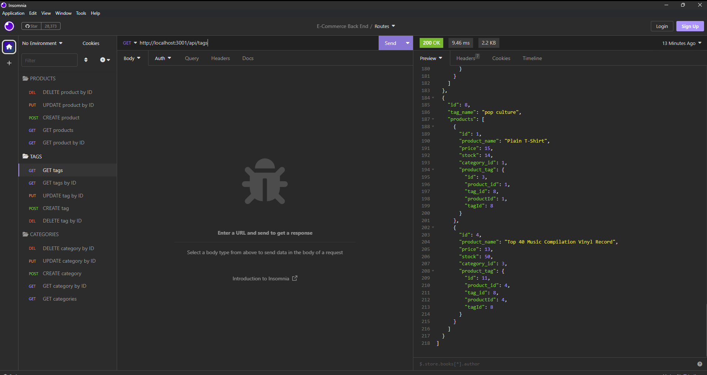

# E-Commence Website Back-End Application

## Description

This is a back-end server application for an e-commerce website. Using Insomnia or other similar applications, you can make GET/POST/PUT/DELETE http requests for products/categories/tags.

## Visuals

Screenshot of pplication running in Insomnia

Demo-video of MySQL initialization, database seeding, server initialization, and Insomnia HTTP requests

https://github.com/zaingova/zaingova-e-commerce-back-end/assets/127261218/3082724c-eb1f-4c4f-9a9c-39a514c9fab0

## Usage

To use this application, first you'll need to run the SQL schema. Then, 'npm i' to install the required dependencies adn seed the database by running 'node seeds/index.js'. Then you can start the server by running 'npm start'. Once all of this is done you can head to Insomnia and test the routes along with the HTTP requests you want to use.

## License

This project uses The MIT License. Click on the badge below or at the top of the README for more information

